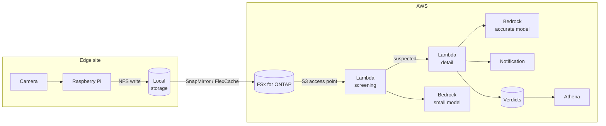

> 🌐 Language: [日本語](../../ja/aws-patterns/01-edge-ai-bedrock.md) | **English**

# Pattern 01: Edge AI + Amazon Bedrock

> **Maturity**: implemented (partly) / **Last verified**: 2026-08-19

Images captured at the edge are written to file storage, reach an aggregation point, and are judged
by a Bedrock foundation model. Image classification can start without training a custom model.

## Implementation status

| Stage of the path | In this repository | Location |
|---|---|---|
| Edge capture → local storage (NFS) | Implemented | [`edge/raspberry-pi/camera/`](../../../edge/raspberry-pi/camera/) |
| Detecting file arrival | Implemented (direct invoke from the Pi; FPolicy is design only) | [`usecases/3d-print-quality/`](../../../usecases/3d-print-quality/) |
| Two-stage analysis on Bedrock | Implemented | [`cloud/ai/image_analyzer/`](../../../cloud/ai/image_analyzer/) |
| Storing verdicts and alerting | Implemented | Same (S3 + SNS) |
| Recording human feedback | Implemented | [`cloud/ai/feedback_recorder/`](../../../cloud/ai/feedback_recorder/) |
| SQL analysis over verdicts | Implemented | Athena queries in `usecases/*/template.yaml` |
| Agentic workflow (multi-step decisions, process integration) | Design only | [Agentic AI on AWS](../agentic-ai-on-aws.md) |

Nothing has run against a real ONTAP system or a real camera
([limits](../../../README_en.md#about-this-repository)).

## Data flow

Drawn with the official icons: [SVG](../../images/pattern-01-edge-ai-bedrock-en.svg) (source [pattern-01-edge-ai-bedrock-en.drawio](../../diagrams/pattern-01-edge-ai-bedrock-en.drawio), regenerated as described in [docs/diagrams/](../../diagrams/))

1. The camera captures at an interval and the Pi writes to local storage over NFS
2. The payload syncs to the aggregation point (FSx for ONTAP). For choosing the route, see
   [FlexCache versus SnapMirror](../iot-greengrass-flexcache-integration.md)
3. Lambda fetches the image through an S3 access point and first asks a cheap model whether it looks
   normal
4. Only images suspected of a defect go to the accurate model for detailed findings
5. Verdicts are stored, and a notification fires past a threshold
6. Accumulated verdicts are aggregated with Athena

## Storage

- **Payload (images)**: kept in file storage, not duplicated into object storage
- **Verdicts**: stored separately as structured data, carrying a reference to the image
- **Edge buffer**: to keep capturing through a network outage, the write has to commit at the edge —
  either a write-back cache or independent storage with a later sync
- **Ageing images**: design tiering for images whose access frequency drops, from the start

## AI workflow

**Two stages exist** because in a workload where most verdicts are "normal", sending everything to
the accurate model makes per-call price dominant. A cheap model narrows the set, and only suspected
cases escalate.

Three things have to be decided about the staging.

| Decision | Effect |
|---|---|
| The first-stage threshold | Too low and second-stage calls increase; too high and misses increase |
| Where prompts live | In code, changing them needs a deploy; in configuration, operations can turn them |
| How human labels return | Without them, neither the threshold nor the prompts have any basis to improve on |

Going further into agentic behaviour, there is a choice between assembling Bedrock calls in Lambda
and using AgentCore's Runtime, Memory and Gateway. The material for that decision is in
[Agentic AI on AWS](../agentic-ai-on-aws.md).

## Security

The controls as a whole are in the [security design](../security-design.md). Only what is specific
to this pattern:

- **S3 access point authorization has two layers.** An IAM allow is not sufficient: if the file
  system user bound to the access point lacks permission on the file, the request is denied
- **Images can contain confidential detail.** Classify on the assumption that product shapes or
  drawings appear, and design encryption at rest and access logging accordingly
- **Model invocation logs.** Without a record of which model returned what for which image, a
  verdict cannot be explained
- **Edge device credentials.** No long-lived keys on the device; use a device certificate or
  short-lived credentials

## What drives cost

Figures live in the [deployment guide](../deployment-guide.md). Here, only what moves them.

| Driver | How it acts |
|---|---|
| Capture interval | Directly sets the number of judgements. The largest single adjustment |
| Anomaly rate | Sets how often the second stage runs. The lower it is, the more the two-stage design pays off |
| Image resolution and format | Acts on input token volume. Resizing at the edge lowers it |
| Retention | Storage cost. Tiering lowers it |
| Aggregation point | File storage is billed on capacity, independent of the number of judgements |

## Assumptions and constraints

- **AWS publishes a walkthrough for using AWS Lambda through an S3 access point**
  ([source](https://docs.aws.amazon.com/fsx/latest/ONTAPGuide/tutorial-process-files-with-lambda.html)).
  In this design it is Lambda that calls Bedrock, not the access point. What the list of
  supported services names is Bedrock Knowledge Bases, which is a different thing from model
  invocation ([how to read the list](../s3ap-compatibility-matrix.md)). It requires ONTAP
  9.17.1 or later, the same Region and the same account
  ([constraint list](../s3ap-compatibility-matrix.md))
- **File arrival cannot start the flow as an event.** S3 access points do not support event
  notifications, so the trigger is FPolicy, an explicit call from the writer, or polling. This
  repository calls directly from the Pi
- **Whether Greengrass Stream Manager accepts an S3 access point is unverified**
  ([§4](../s3ap-compatibility-matrix.md)). Writing from the edge assumes a hand-written boto3
  PutObject
- **Verdicts and Athena's query results are written to a standard S3 bucket**, not to the access
  point. Athena officially requires its query results location to be an S3 bucket, and verdicts
  currently go to the shared stack's bucket (`RESULT_BUCKET`) as well
  ([Services that require an S3 bucket name](../s3ap-compatibility-matrix.md#4-services-that-require-an-s3-bucket-name))
- **Accuracy is from synthetic tests only.** Accuracy under real lighting, angle and material colour
  is unverified
- **Bedrock model availability differs by Region.** Confirm the model you intend to use can be
  enabled in the target Region first

## References

- [Using access points with AWS services](https://docs.aws.amazon.com/fsx/latest/ONTAPGuide/using-access-points-with-aws-services.html)
- [Process files serverlessly using Lambda](https://docs.aws.amazon.com/fsx/latest/ONTAPGuide/tutorial-process-files-with-lambda.html)
- [Amazon Bedrock AgentCore](https://docs.aws.amazon.com/bedrock-agentcore/latest/devguide/what-is-bedrock-agentcore.html)
- Related: [Pattern 02](02-edge-ai-sagemaker.md) (training your own model) /
  [Pattern 09](09-edge-agentic-ai.md) (placing the decision at the edge)
