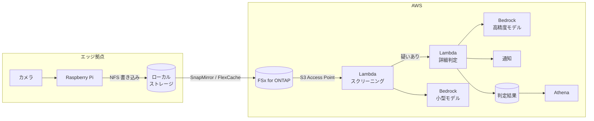

> 🌐 Language: **日本語** | [English](../../en/aws-patterns/01-edge-ai-bedrock.md)

# Pattern 01: エッジ AI + Amazon Bedrock

> **成熟度**: 実装あり（一部） / **最終確認**: 2026-08-19

エッジで撮った画像をファイルストレージに書き、集約先を経由して Bedrock の基盤モデルに
判定させる構成。カスタムモデルの学習をせずに画像判定を始められます。

## 実装状況

| 経路の段 | このリポジトリ | 場所 |
|---|---|---|
| エッジ撮影 → ローカルストレージ (NFS) | 実装あり | [`edge/raspberry-pi/camera/`](../../../edge/raspberry-pi/camera/) |
| ファイル到着の検知 | 実装あり（Pi から直接 invoke。FPolicy は設計のみ） | [`usecases/3d-print-quality/`](../../../usecases/3d-print-quality/) |
| Bedrock で 2 段階分析 | 実装あり | [`cloud/ai/image_analyzer/`](../../../cloud/ai/image_analyzer/) |
| 判定結果の保存とアラート | 実装あり | 同上（S3 + SNS） |
| 人手フィードバックの記録 | 実装あり | [`cloud/ai/feedback_recorder/`](../../../cloud/ai/feedback_recorder/) |
| 判定結果の SQL 分析 | 実装あり | `usecases/*/template.yaml` の Athena クエリ |
| エージェント処理（複数ステップの判断・工程連携） | 設計のみ | [Agentic AI on AWS](../agentic-ai-on-aws.md) |

実 ONTAP 環境と実カメラでの検証は未実施です（[制約](../../../README.md#このリポジトリについて)）。

## データフロー

公式アイコンで描いた版: [SVG](../../images/pattern-01-edge-ai-bedrock.svg)（作図元は [pattern-01-edge-ai-bedrock.drawio](../../diagrams/pattern-01-edge-ai-bedrock.drawio)、生成手順は [docs/diagrams/](../../diagrams/)）

1. カメラが一定間隔で撮影し、Pi がローカルストレージに NFS で書き込む
2. ペイロードは集約先（FSx for ONTAP）へ同期される。経路の選択は
   [FlexCache / SnapMirror の使い分け](../iot-greengrass-flexcache-integration.md)を参照
3. Lambda が S3 Access Point 経由で画像を取得し、まず安価なモデルで正常/異常を判定する
4. 異常の疑いがある画像だけを高精度モデルに回し、詳細な所見を得る
5. 判定結果を保存し、閾値を超えたら通知する
6. 蓄積された判定結果を Athena で集計する

## ストレージ

- **ペイロード（画像）**: ファイルストレージに置く。オブジェクトストレージに二重に持たない
- **判定結果**: 構造化データとして別に保存する。画像への参照を持たせる
- **エッジ側のバッファ**: ネットワーク断中も撮影を続けるなら、エッジ側に書き込みが確定する
  経路が必要。write-back キャッシュか、独立ストレージ + 事後同期のいずれか
- **古い画像**: アクセス頻度が落ちた画像を安価な階層へ移す設計を最初から入れておく

## AI ワークフロー

**2 段階にする理由**は、判定の大半が「正常」であるワークロードでは、全件を高精度モデルに
通すと呼び出し単価が支配的になるためです。安価なモデルで絞り、疑いのみ高精度モデルに回します。

段の設計で決めることが 3 つあります。

| 決めること | 影響 |
|---|---|
| 1 段目の閾値 | 低いと 2 段目の呼び出しが増える。高いと見逃しが増える |
| プロンプトの持ち方 | コードに埋めると変更にデプロイが必要。設定に出すと運用で回せる |
| 人手ラベルの戻し方 | 戻さないと閾値もプロンプトも改善の根拠を持てない |

エージェント処理まで進める場合、Bedrock の呼び出しを Lambda で組み立てる代わりに
AgentCore の Runtime / Memory / Gateway を使う選択があります。判断材料は
[Agentic AI on AWS](../agentic-ai-on-aws.md) にあります。

## セキュリティ

統制の全体は [セキュリティ設計](../security-design.md) にあります。このパターン固有の点だけ。

- **S3 Access Point の認可は 2 層**。IAM で許可しても、access point に紐づいたファイルシステム
  ユーザーがファイルへの権限を持たなければ拒否されます
- **画像は機密情報を含みうる**。製品形状や図面が写る前提で分類し、保管先の暗号化と
  アクセスログを設計に入れます
- **モデル呼び出しのログ**。どの画像にどのモデルが何を返したかを残さないと、
  判定の説明ができません
- **エッジデバイスの資格情報**。長期キーを置かず、デバイス証明書か短期資格情報を使います

## コストの考え方

金額は [デプロイガイド](../deployment-guide.md) にあります。ここでは何が費用を動かすかだけ。

| 費用を駆動するもの | 効き方 |
|---|---|
| 撮影間隔 | 判定回数に直接効く。最も効果が大きい調整点 |
| 異常率 | 2 段目の呼び出し回数を決める。異常率が低いほど 2 段構成の効果が大きい |
| 画像の解像度と形式 | 入力トークン量に効く。エッジ側でリサイズすると下がる |
| 保存期間 | ストレージ費用。階層化で下げられる |
| 集約先の構成 | ファイルストレージは容量課金で、判定回数には依存しない |

## 前提と制約

- **S3 Access Point 経由で AWS Lambda を使う構成は AWS が手順を公開しています**
  （[出典](https://docs.aws.amazon.com/fsx/latest/ONTAPGuide/tutorial-process-files-with-lambda.html)）。
  この構成で Bedrock を呼ぶのは Lambda であって、access point 経由ではありません。
  対応サービス一覧に載っているのは Bedrock Knowledge Bases で、モデル呼び出しとは別物です
  （[閉じた一覧としての読み方](../s3ap-compatibility-matrix.md)）。
  ただし ONTAP 9.17.1 以降、同一リージョン、同一アカウントが必要
  （[制約一覧](../s3ap-compatibility-matrix.md)）
- **ファイル到着をイベントで起動できません。** S3 AP はイベント通知に対応しないため、
  起点は FPolicy か、書き込んだ側からの明示的な呼び出し、またはポーリングになります。
  このリポジトリは Pi から直接呼び出す形を採っています
- **Greengrass の Stream Manager が S3 AP を受け付けるかは未検証**です
  （[§4](../s3ap-compatibility-matrix.md)）。エッジ側からの書き込みは boto3 の PutObject を
  自前で書く前提になります
- **判定結果と Athena のクエリ結果は標準の S3 バケットに書きます。** access point ではありません。
  Athena はクエリ結果の出力先が S3 バケットであることを公式に要求し、判定結果も現在は共有スタックの
  バケット（`RESULT_BUCKET`）に書いています
  （[S3 バケット名を要求するサービス](../s3ap-compatibility-matrix.md#4-s3-バケット名を要求するサービス)）
- **判定精度は合成テストのみ**。実環境の照明・角度・素材色での精度は未検証です
- **Bedrock のモデル可用性はリージョンで異なります。** 使うモデルが対象リージョンで
  有効化できるかを先に確認してください

## 参考

- [Using access points with AWS services](https://docs.aws.amazon.com/fsx/latest/ONTAPGuide/using-access-points-with-aws-services.html)
- [Process files serverlessly using Lambda](https://docs.aws.amazon.com/fsx/latest/ONTAPGuide/tutorial-process-files-with-lambda.html)
- [Amazon Bedrock AgentCore](https://docs.aws.amazon.com/bedrock-agentcore/latest/devguide/what-is-bedrock-agentcore.html)
- 関連: [Pattern 02](02-edge-ai-sagemaker.md)（自前モデルを学習する場合） /
  [Pattern 09](09-edge-agentic-ai.md)（判断をエッジに置く場合）
