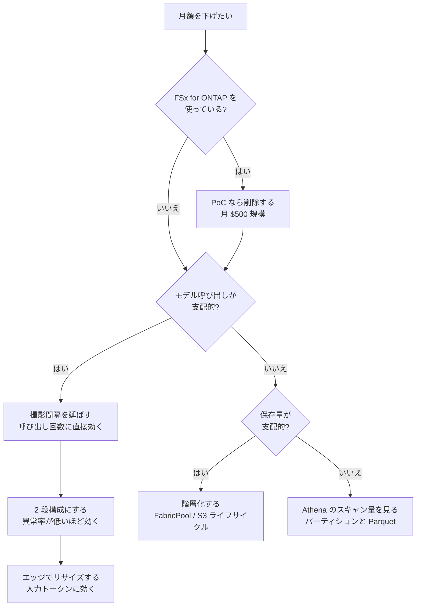

> 🌐 Language: **日本語** | [English](../en/cost-model.md)

# コストモデル

> **価格取得日**: 2026-08-19 / **リージョン**: ap-northeast-1

## 結論

**この構成で桁を間違えると事故るのは FSx for ONTAP だけです。** PoC 構成（1 TiB SSD、
128 MBps、Multi-AZ）で月 **$500.61**、確認した単価からの計算です。他のサービスは PoC 規模では
数ドルから数十ドルで、モデル料金だけが使い方に強く依存します。

以前このリポジトリには同じ前提（60 秒間隔・異常率 10%）に対して月額が 3 通りありました。
**$40 / $75 / $259 は撤回しました。** 単価の出典が異なるものが混在していて、どれも再現できません。
代わりに式を置いています。自分の単価を入れて計算してください。

## 価格の基準

| 項目 | 値 |
|---|---|
| 取得日 | 2026-08-19 |
| リージョン | ap-northeast-1（Asia Pacific 東京） |
| 取得方法 | AWS Price List Query API（`AmazonFSx`） |
| 単価の effectiveDate | 2026-07-01 |
| 価格表の publicationDate | 2026-08-05 |
| 課金モデル | オンデマンド。Savings Plans / Reserved は考慮していない |

**この表の日付が古いと感じたら、それは古いです。** 価格は変わります。下の式は単価を差し替えれば
そのまま使えるように書いてあります。再取得は
[AWS Pricing Calculator](https://calculator.aws/) か
[Price List API](https://docs.aws.amazon.com/awsaccountbilling/latest/aboutv2/price-changes.html) で行ってください。

## 桁を知る必要があるもの — FSx for ONTAP

削除を忘れると請求が三桁ドルになります。PoC が終わったら
[`scripts/teardown.sh`](../../scripts/teardown.sh) で消してください。

| 課金軸 | 単価（ap-northeast-1、2026-08-19 取得） | PoC 構成 | 月額 |
|---|---|---|---|
| SSD ストレージ (Multi-AZ) | $0.300 / GB-月 | 1024 GiB | $307.20 |
| スループットキャパシティ (Multi-AZ) | $1.511 / MBps-月 | 128 MBps | $193.41 |
| **合計** | | | **$500.61** |

計算式:

```
月額 = ストレージ容量(GiB) × $0.300 + スループット(MBps) × $1.511
     = 1024 × 0.300 + 128 × 1.511
     = 307.20 + 193.41
     = 500.61
```

Single-AZ、HDD、容量プール階層（FabricPool）は単価が異なります。バックアップと
プロビジョンド IOPS を追加すると別途加算されます。上の式はこの 2 軸だけです。

> **注**: 容量は GiB で指定し、課金は GB-月 の単位で表されます。この差は上の式では
> 無視しています。厳密な見積りが必要なら Pricing Calculator を使ってください。

## 式だけにしているもの — Bedrock のモデル料金

**絶対額を書きません。** 理由が 2 つあります。

1. **変動が速い。** モデルの世代が変わると単価も変わります。ここに書いた数値は次の世代で
   誤りになり、読者にはそれが分かりません。
2. **Price List API がモデル名に紐付きません。** `AmazonBedrockFoundationModels` は
   ap-northeast-1 のトークン単価を返しますが、`operation` フィールドが空です。$2 / $5 / $10
   per 1M input tokens という値は取れても、どれが Haiku でどれが Sonnet かを API から判定
   できません。自動再計算の経路がないので、生成もできません。

計算式:

```
1 画像あたり = Σ(段ごと) [ 入力トークン ÷ 1,000,000 × 入力単価
                        + 出力トークン ÷ 1,000,000 × 出力単価 ]

月額 = 1 日の撮影回数 × 30
       × [ スクリーニング単価 + 異常率 × 詳細判定単価 ]
```

2 段構成の削減幅は**異常率で決まります**。異常率が上がるほど 2 段目の呼び出しが増え、
単段構成との差は縮みます。異常率 100% では 2 段構成のほうが高くなります（スクリーニングの
呼び出しが純粋な追加になるため）。

### トークン数の実測値の不在

式の入力であるトークン数を、このリポジトリは長らく取得していませんでした。
`cloud/ai/image_analyzer/handler.py` が Bedrock 応答の `usage` を捨てていたためです。
これは修正済みで、いまは `InputTokens` / `OutputTokens` を CloudWatch に出します。

ただし**実際のトークン数はまだ記録がありません**。スタックをデプロイしていないためです
（[検証状態](verification-status.md)）。式は使えますが、代入する値は自分の環境で測って
ください。

### CostPerImage メトリクスを出すには

単価は環境変数で渡します。コードに焼くと上と同じ陳腐化を起こすためです。

| 環境変数 | 意味 |
|---|---|
| `SCREENING_INPUT_USD_PER_MTOK` | スクリーニング段の入力 100 万トークン単価 |
| `SCREENING_OUTPUT_USD_PER_MTOK` | 同 出力 |
| `DETAIL_INPUT_USD_PER_MTOK` | 詳細判定段の入力 |
| `DETAIL_OUTPUT_USD_PER_MTOK` | 同 出力 |

4 つ揃うと `EdgeToCloud/PrintQuality` 名前空間に `CostPerImage` が出ます。1 つでも欠けると
**出しません**。一部の段だけを合計した値は「安い画像」に見えて「単価が未設定」には見えない
ためです。トークン数は単価がなくても出ます。

## その他のサービス

PoC 規模（1 デバイス、60 秒間隔）では、上の 2 つ以外は合計で数ドルから数十ドルです。
絶対額を書かず、何が費用を動かすかだけ挙げます。

| サービス | 費用を動かすもの |
|---|---|
| AWS Lambda | 呼び出し回数 × 実行時間 × メモリ。撮影間隔が直接効く |
| Amazon S3 | 保存量と PUT 回数。ライフサイクルで階層化すると下がる |
| Amazon Kinesis Data Streams | ON_DEMAND は取り込み量とシャード時間。低トラフィックなら PROVISIONED が安いことがある |
| Amazon Data Firehose | 取り込み量（GB 単位の処理料金）。Lambda で集約すれば経路自体を省ける |
| Amazon Athena | スキャンしたバイト数。パーティションと列指向形式で下がる |
| AWS Glue Crawler | 実行回数 × 実行時間。日次を週次にすると下がる |
| Amazon SNS | 通知数。PoC 規模では小さい |
| AWS IoT Core | メッセージ数。Basic Ingest でルール経由の課金を避けられる |

## 撤回した数値

出典が再現できないものを消しました。何を消したかを書き残すのは、以前の版を読んだ人が
差分を追えるようにするためです。

| 撤回した主張 | 撤回した理由 |
|---|---|
| 2 段構成で月 $40（単段は月 $259） | 同じ前提で `tests/sample_images/README.md` の式は月 $78 になり、$40 は約半額の単価を仮定していた。どちらの単価も出典がない |
| 1 画像あたり $0.005〜0.011 | 公開価格からの手計算。トークン数の記録がなく再現できない。測定結果の表に並んでいたため実測値に見えていた |
| 月 $75 / $54 / $360 のシナリオ表 | 上と同じ単価問題。式は残し、金額を外した |
| 合計 ~$570–730 / ~$70–230 | 各行の幅を足した値で、計算式がない |
| 合計 約 ¥1,500-4,000/月 | ドル建ての行と円建ての行を為替レートなしで合算していた |
| デフォルトのフラッシュ間隔 30-90s | 出典がない。同じ図の別行は「未計測」と書いていた |

## コスト削減の判断フロー



## 段階的なコスト管理の手順

1. **デプロイ前**: この doc の式に自分の単価を入れて桁を出す。FSx for ONTAP を使うなら
   削除予定日を決める
2. **デプロイ直後**: [AWS Budgets](https://docs.aws.amazon.com/cost-management/latest/userguide/budgets-managing-costs.html)
   でアラートを設定する。PoC では見積りの 1.5 倍あたりが実用的な閾値
3. **1 日運用したら**: `InputTokens` / `OutputTokens` の実測から 1 画像あたりのトークン数を
   確定し、式に戻す
4. **単価を確定したら**: 上の 4 つの環境変数を設定して `CostPerImage` を出す。
   [運用設計](operations-design.md)のアラーム閾値はこのメトリクスを前提にしている
5. **PoC 終了時**: [`scripts/teardown.sh`](../../scripts/teardown.sh) で削除する。
   データレイクのバケットは `DeletionPolicy: Retain` で残るので別途削除する

## FAQ

**Q: なぜ月額の合計表がないのですか?**
A: 以前ありましたが、各行の幅を足しただけの値で計算式がなく、同じ前提から 3 通りの答えが
出ていました。合計が必要なら Pricing Calculator に構成を入れてください。この doc は
「何が費用を動かすか」と「桁を間違えると事故るもの」に絞っています。

**Q: `~$500+/月` の `+` は何ですか?**
A: 上の式に入っていない課金軸があるという意味です。バックアップ、プロビジョンド IOPS、
容量プール階層、リージョン間転送が加わります。1 TiB / 128 MBps / Multi-AZ の 2 軸だけで
$500.61 なので、実際の請求はこれ以上になります。

**Q: 無料利用枠は使えますか?**
A: 対象と条件は変わります。2025 年に新規アカウントのプランが変わっており、この doc に
条件を書き写すと古くなります。
[AWS 無料利用枠](https://aws.amazon.com/free/)で現行の条件を確認してください。
FSx for ONTAP は無料利用枠の対象外です。

**Q: 2 段構成は必ず安くなりますか?**
A: いいえ。異常率で決まります。異常率が高いと 2 段目がほぼ毎回走り、スクリーニングの
呼び出しが純粋な追加コストになります。異常率 100% では単段構成より高くなります。
自分の異常率を入れて式を計算してください。

**Q: このリポジトリの請求実績はありますか?**
A: ありません。スタックをデプロイした記録がないので、あるのは公開価格からの試算だけです
（[検証状態](verification-status.md)）。

## 関連ドキュメント

- [検証状態](verification-status.md) — どの数値をどの根拠で引けるか
- [デプロイガイド](deployment-guide.md) — 構築手順。§8 はこの doc を参照する
- [運用設計](operations-design.md) — `CostPerImage` を含むメトリクスとアラーム
- [S3 AP 互換性と制約](s3ap-compatibility-matrix.md) — 経路の選択がコストに影響する箇所
- [AWS パターンカタログ](aws-patterns/README.md) — パターンごとの「費用を駆動する要素」
