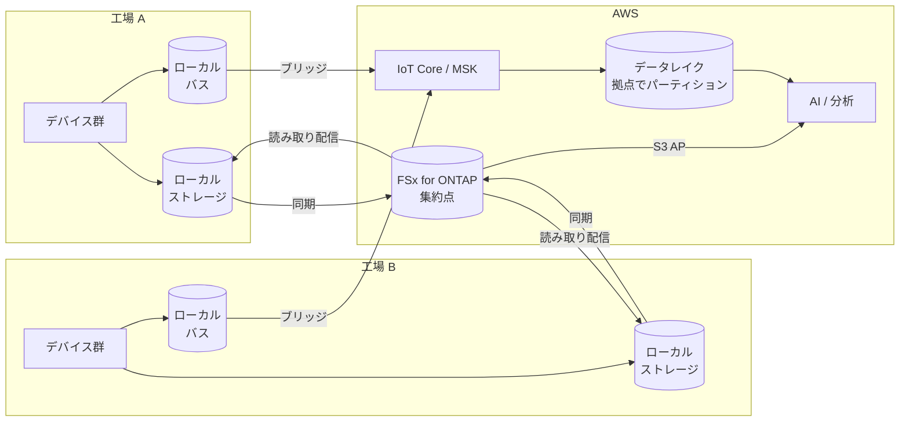

> 🌐 Language: **日本語** | [English](../../en/deployment-models/model-b-multi-factory.md)

# Model B: 複数工場

> 最終確認: 2026-08-19

複数拠点。各拠点でデータが生まれ、横断で分析したい構成。

**このリポジトリでは複数拠点の実運用を検証していません。** [Model A](model-a-single-factory.md)
の構成を拡張する形で設計しています。

## A との違いは 3 点

| 変わること | A | B |
|---|---|---|
| 拠点の識別 | 暗黙（1 つしかない） | すべての経路で明示的に必要 |
| データの集約点 | 拠点 = 集約点 | 拠点の外に集約点があり、拠点ごとに同期経路を持つ |
| 障害の影響範囲 | 拠点が止まれば全部止まる | 1 拠点の障害を他拠点に波及させない設計が必要 |

**残りは A と同じです。** AI 経路、ストレージの種別、セキュリティの原則は変わりません。

## データフロー



1. 各拠点でローカルに書き、ローカルで使う（拠点内の可視化は拠点内で完結させる）
2. 集約点へ同期する。**同期は拠点ごとに独立させます**
3. イベントはブリッジでクラウドへ。すべてを送らず、横断分析に必要なものを選びます
4. 集約点で横断分析を行う
5. 集約されたデータ（学習済みモデル、基準値）を各拠点へ配信する

**双方向になる点が A との最大の違いです。** 拠点 → 集約点だけでなく、
集約点 → 拠点の配信経路が必要になります。

## ストレージフロー

| 経路 | 手段の例 | 向く条件 |
|---|---|---|
| 拠点 → 集約点（ペイロード） | ブロックレベルの差分同期 | 拠点が独立して書き続ける。帯域が限られる |
| 拠点 → 集約点（書き込みキャッシュ） | write-back キャッシュ | 集約点を権威にしたい。ネットワーク断中も書き込みを続けたい |
| 集約点 → 拠点（読み取り） | 読み取りキャッシュ | 学習済みモデルや基準データを複数拠点に配る |
| イベント | メッセージバスのブリッジ | メタデータのみ。実体は運ばない |

使い分けの詳細は
[FlexCache / SnapMirror の比較](../iot-greengrass-flexcache-integration.md) にあります。
**write-back を使う場合、バージョン要件と本番向けの注意があります**（同 doc）。

### パーティション設計における拠点の位置

```
/{データ種別}/site={拠点ID}/year={YYYY}/month={MM}/day={DD}/device={デバイスID}/
```

**拠点をパーティションの上位に置くと、拠点単位のクエリと削除が安くなります。**
逆に、時系列を上位に置くと拠点横断のクエリが速くなります。どちらを優先するかは
主なクエリパターンで決めます。後から変えるのは高くつきます。

## AI ワークフロー

拠点が増えると、判断が 2 つ増えます。

| 判断 | 選択肢 | trade-off |
|---|---|---|
| モデルを拠点ごとに持つか、共通にするか | 共通: 学習データが集まる / 拠点別: 拠点の癖に合う | 共通モデルは拠点ごとの照明・設備差で精度が落ちる。拠点別はモデル数が増える |
| 推論をどこで行うか | 集約点 / 各拠点 | 集約点は運用が 1 か所。拠点はネットワーク断に強い |

**拠点ごとの差が精度に効きます。** 照明、カメラ設置、設備の型番、素材のロット。
1 拠点で高精度だったモデルが別拠点で落ちるのは通常のことです。
拠点をまたぐ前に、拠点ごとの評価データを持つ設計にしてください。

## セキュリティ統制

| 項目 | B で変わること |
|---|---|
| 拠点間の分離 | 拠点 A の資格情報で拠点 B のデータが読めない設計にする。パーティション設計と権限設計を対応させる |
| デバイスの数 | 手動プロビジョニングが破綻する。証明書の自動発行と失効の仕組みが必要 |
| ネットワーク | 拠点ごとに閉域接続を張るか、拠点からインターネット経由にするかを決める |
| 障害の切り離し | 1 拠点の異常が集約点を通じて他拠点に波及しない構成にする |
| 監査ログ | 拠点をまたぐ操作の記録。時刻の同期が前提になる |

**権限の設計をパーティション設計と対応させてください。** データレイクのパスに
拠点が入っていても、権限が拠点で切られていなければ意味がありません。
[セキュリティ設計 §15](../security-design.md) の階層で、どこで拠点を切るかを決めます。

## コストの考え方

| 費用を駆動するもの | B で効き方が変わる点 |
|---|---|
| 拠点数 | 固定費（エッジ側のストレージ、ゲートウェイ）が拠点数に比例する |
| 同期の帯域 | 差分同期なら変更量、全体転送なら総量。ここで桁が変わる |
| クラウドへ送るイベント数 | ブリッジで絞るかどうか。拠点数 × デバイス数で増える |
| 読み取り配信 | モデルや基準データを配る量。参照方式なら読まれた範囲のみ |
| 集約点の構成 | 拠点が増えても集約点は 1 つ。容量とスループットのサイジングが効く |

**A では固定費が支配的でしたが、B では同期と転送の比率が上がります。**
拠点を増やす前に、1 拠点あたりの転送量を測っておくと見積りができます。
このリポジトリでは未測定です。

## A から B へ移るとき

移行で高くつく順に挙げます。

1. **拠点識別子の追加**（最も高い）。イベントスキーマ、ストレージパス、
   クエリ、ダッシュボードのすべてに影響します。A の時点で入れておけば発生しません
2. **パーティション設計の変更**。既存データの再配置が必要になります
3. **権限設計の再構築**。単一利用者前提から、拠点で切る形へ
4. **デバイスプロビジョニングの自動化**。手動が破綻する台数の前に用意します
5. **配信経路の追加**（集約点 → 拠点）。A には存在しない経路です

## 前提と制約

- **複数拠点の実運用を検証していません。** 設計として読んでください
- **拠点間のデータ同期は未検証**です。同期の遅延と失敗時の挙動は未確認です
- **拠点ごとのモデル精度差は未測定**です
- **1 拠点あたりの転送量が未測定**のため、拠点数を増やしたときの見積りができません
- **デバイスプロビジョニングの自動化が未実装**です
- **write-back キャッシュを使う場合、本番向けのバージョン注意があります**
  （[iot-greengrass-flexcache-integration](../iot-greengrass-flexcache-integration.md)）

## 参考

- [Model A: 単一工場](model-a-single-factory.md) — 共通部分
- [FlexCache / SnapMirror の比較](../iot-greengrass-flexcache-integration.md) — 同期手段の選択
- [Pattern 08: 統合名前空間](../aws-patterns/08-unified-namespace.md) — 拠点を含む名前空間の設計
- [セキュリティ設計](../security-design.md)
